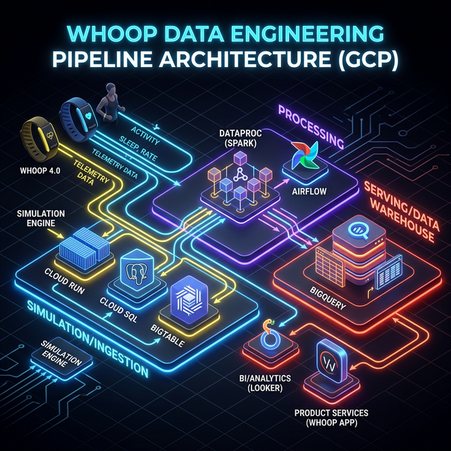
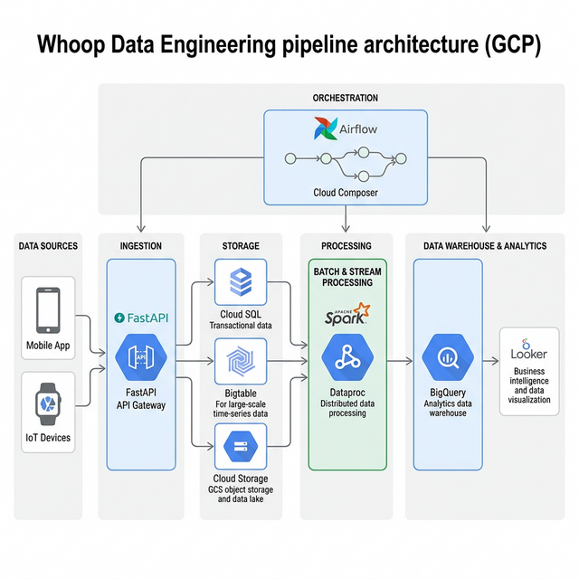

# Whoop IoT Data Engineering Pipeline
![Whoop Data Engineering pipeline architecture (GCP) - Dark Theme]

This project simulates an enterprise-grade IoT Data Engineering pipeline, ingesting both massive-scale batch data and high-frequency streaming sensor data from wearable fitness devices (like Whoop rings). 

The goal of this system is to ingest raw physiological telemetry (Heart Rate, HR Variability, Skin Temp, Sleep Stages) and process it into a highly optimized Dimensional Data Warehouse for downstream product analytics and personal health dashboards.

## Technology Stack
*   **Infrastructure as Code (IaC):** Terraform
*   **OLTP Database:** Cloud SQL (PostgreSQL)
*   **NoSQL / Time-Series Database:** Cloud Bigtable
*   **Data Lake:** Google Cloud Storage (GCS)
*   **Compute / Processing:** Apache Spark (PySpark) on Google Cloud Dataproc
*   **Orchestration:** Apache Airflow
*   **Data Warehouse:** Google BigQuery
*   **API & Simulation Layer:** FastAPI (Python)

---

## The Two-Pronged Ingestion Architecture


### 1. The Batch Pipeline (OLTP)
Daily summaries and workout sessions are compiled directly on the user's phone. When they open the app, this data syncs to a backend API which normalizes the records (Users, Devices, Workouts, Health Rollups) into a **Cloud SQL PostgreSQL** database.

### 2. The Streaming Pipeline (IoT Sensors)
During a workout, the wearable device continuously broadcasts raw heart rate and skin temperature metrics every second. This massive influx of time-series data bypasses the relational database entirely and is streamed directly into an ultra-fast **Cloud Bigtable** instance.

---

## The ETL / Processing Layer
The true Data Engineering magic happens orchestrating **Apache PySpark**. An **Apache Airflow DAG** executes two concurrent massive processing jobs on an ephemeral Dataproc cluster:

1.  **`spark_elt_oltp.py`**: Connects via JDBC to the Postgres instance, extracts the heavily normalized tables, executes business logic (e.g., calculating Basal Metabolic Rates, Performance Age, and rolling 7-day Accumulated Fatigue levels via Window functions), and models the output into a Star Schema inside BigQuery (`dim_users`, `fact_workouts`, `fact_daily_health`).
2.  **`spark_elt_streaming.py`**: Connects to the massive Bigtable cluster, rips through millions of second-by-second telemetry pings, downsamples and aggregates them into clean `hourly_vital` row maximums and averages to save BigQuery ingestion costs and boost dashboard load speeds. 

---

## Business Impact & Derived Insights
Because the data is carefully modeled into a Star Schema, Data Scientists and Product Managers can easily query BigQuery to answer critical questions:
*   *Which firmware versions are repeatedly failing to record sleep data?*
*   *Are cardiovascular strain scores actively reducing next-day Heart Rate Variability?*
*   *What is the platform's overall user retention layered against their 30-day "Recovery" metrics?*

## Comprehensive Cloud Deployment Guide

To deploy this architecture directly onto Google Cloud Platform instead of running locally, follow these detailed steps. Note that some GCP resources (Bigtable, Cloud SQL) incur hourly costs. Make sure to tear down resources when not in use.

### Phase 1: Google Cloud Setup & Authentication
1. **Create a GCP Project**: Go to the Google Cloud Console and create a new project. Enable Billing.
2. **Enable APIs**: Navigate to "APIs & Services" and enable the following:
   - Compute Engine API
   - Cloud SQL Admin API
   - Cloud Bigtable Admin API
   - Dataproc API
   - Cloud Storage
3. **Service Account Creation**: 
   - Go to `IAM & Admin` -> `Service Accounts`.
   - Create a new service account (e.g., `whoop-etl-admin`).
   - Grant it the following roles: `Editor`, `Storage Admin`, `BigQuery Admin`, `Dataproc Administrator`.
   - Generate a JSON Key, download it to your local machine, and store it securely (e.g., in a `~/.gcp/` folder).

### Phase 2: Infrastructure Provisioning (Terraform)
1. Navigate to the `/infrastructure` directory.
2. Ensure you have the Terraform CLI installed.
3. Update `terraform.tfvars`:
   - Duplicate `terraform.tfvars.example` to `terraform.tfvars`.
   - Insert your `project_id`, desired GCP `region` (e.g., `us-central1`), and the absolute path to your downloaded Service Account JSON key.
4. Run Terraform to spin up Cloud SQL, Bigtable, and GCS buckets:
    ```bash
    terraform init
    terraform plan
    terraform apply -auto-approve
    ```

### Phase 3: Staging the Pipeline
1. **Upload Spark Scripts**: Use the `gsutil` CLI (or GCP Console) to upload your PySpark files to the newly created Storage Bucket:
    ```bash
    gsutil cp ../transformations/spark_*.py gs://<YOUR_SCRIPT_BUCKET_NAME>/scripts/
    ```
2. **Upload JDBC Drivers**: You must also upload the PostgreSQL JDBC driver (`postgresql-42.2.xx.jar`) and the HBase/Bigtable Spark Connector JARs into a GCS bucket so Dataproc can access them. Update your Airflow DAG `jar_file_uris` paths accordingly.

### Phase 4: Airflow Orchestration
1. Install Apache Airflow locally (or use Google Cloud Composer).
2. Create a new Airflow **Google Cloud Connection** and supply your service account JSON.
3. Define the required Environment Variables in your local terminal or `.env` file where Airflow is running:
   - `GCP_PROJECT_ID`
   - `GCP_REGION`
   - `GCP_SCRIPT_BUCKET`
   - `GCP_BQ_DATASET`
   - `PG_JDBC_URL` (IP of your Cloud SQL instance)
   - `PG_JDBC_USER` / `PG_JDBC_PASS`
4. Copy `whoop_dag.py` into your Airflow `/dags` folder.
5. Turn on the Airflow scheduler, unpause the DAG, and trigger the workflow. 
   - *You will visually see Airflow spin up a Dataproc cluster, execute the OLTP and Streaming spark jobs concurrently, and securely tear down the cluster upon completion!*

### Phase 5: Verification & Cost Cleanup
1. **Verify BigQuery**: Navigate to BigQuery in the GCP Console. Under your `whoop_dw` dataset, you should see `dim_users`, `fact_workouts`, `fact_daily_health`, and `fact_hourly_vitals` fully populated.
2. **Dashboard**: Connect Looker Studio to these BigQuery tables to visualize the results.
3. **Destroy**: To stop incurring costs for Bigtable and Cloud SQL, return to your terminal:
    ```bash
    cd infrastructure
    terraform destroy
    ```
